# React E-Voting System

A modern, responsive digital voting platform built with React and TypeScript. This application provides a secure, user-friendly interface for conducting elections online — supporting both First-Past-The-Post (FPTP) and Proportional Representation (PR) voting systems.

---

## Features

- **Voting** — Authenticated voters can cast their ballot through a secure voting booth that supports FPTP and PR election types, with real-time vote status tracking.
- **Demo Voting** — A publicly accessible demo booth lets anyone experience the voting process without needing an account, making the system approachable for first-time users.
- **Dark / Light Mode** — A theme toggle is available throughout the application, letting users switch between dark and light colour schemes according to their preference.
- **User Authentication** — Full session-based authentication flow including login, multi-step voter registration with progressive validation, and a forgot-password page.
- **Voter Dashboard** — A personalised dashboard showing the voter's registration status, voting eligibility, and quick links to cast a ballot or view results.
- **Ballot Information** — Dedicated page explaining how ballots are structured and how votes are counted for each supported election type.
- **Live Election Results** — Interactive charts (powered by Recharts) display live or final election results broken down by candidate and party.
- **Candidate & Election Information** — Public-facing pages presenting candidate profiles and general information about the ongoing election.
- **FAQ & Contact Pages** — A frequently-asked-questions page and a contact form for voter support.
- **Protected & Public Routes** — Secure route guards ensure that sensitive pages (dashboard, voting booth) are only accessible to authenticated users.
- **Docker Support** — Production and development `Dockerfile` configurations together with a `docker-compose.yml` for easy containerised deployment.

---

## Tech Stack

| Layer | Technology |
|---|---|
| UI Framework | React 19 + TypeScript |
| Build Tool | Vite 7 (SWC compiler) |
| Routing | React Router DOM v7 |
| State Management | React Context API |
| Forms | React Hook Form |
| HTTP Client | Axios (with CSRF support) |
| Styling | Tailwind CSS v4 |
| Charts | Recharts |
| Containerisation | Docker / Docker Compose |

---

## Getting Started

### Prerequisites
- Node.js ≥ 18
- npm ≥ 9

### Installation

```bash
# Clone the repository
git clone https://github.com/RohanBaral16/react-voting-system.git
cd react-voting-system/day-1

# Install dependencies
npm install

# Copy and configure environment variables
cp .env.example .env

# Start the development server
npm run dev
```

The app will be available at `http://localhost:5173`.

### Docker

```bash
# From the day-1 directory
docker compose up --build
```

---

## Screenshots


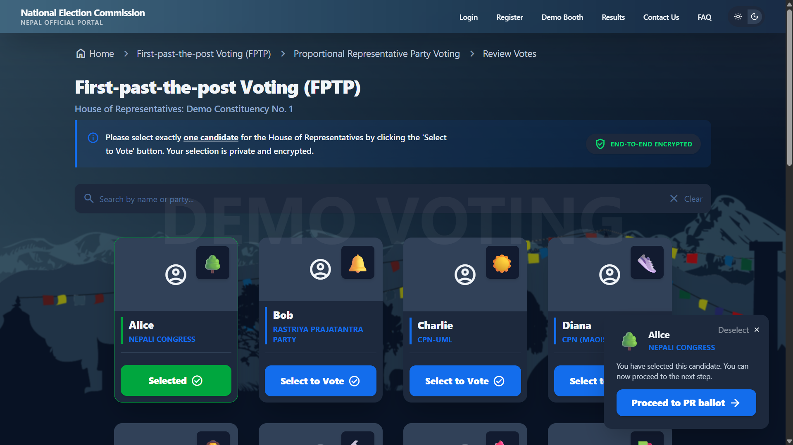

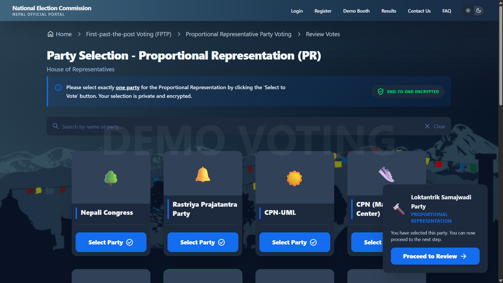

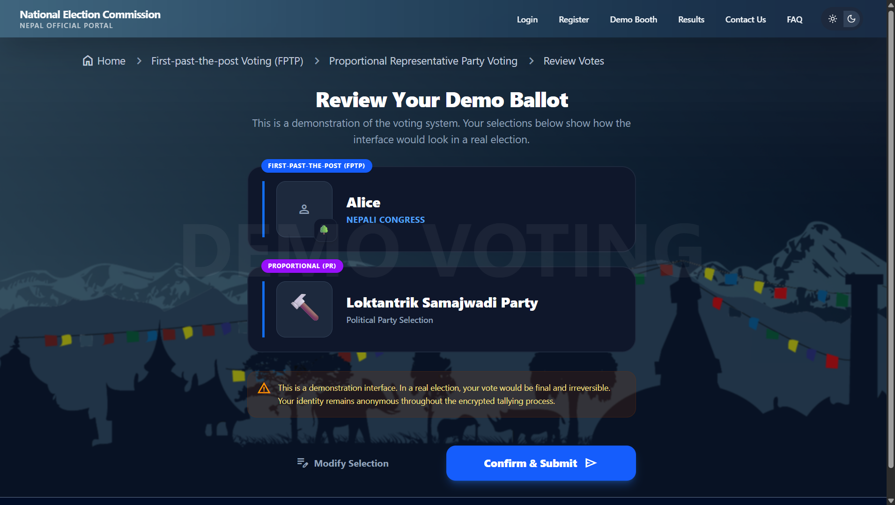

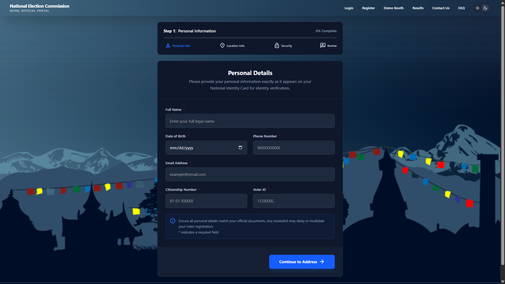

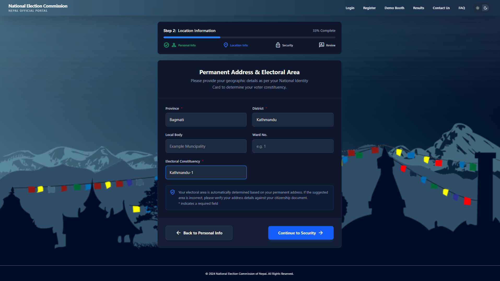

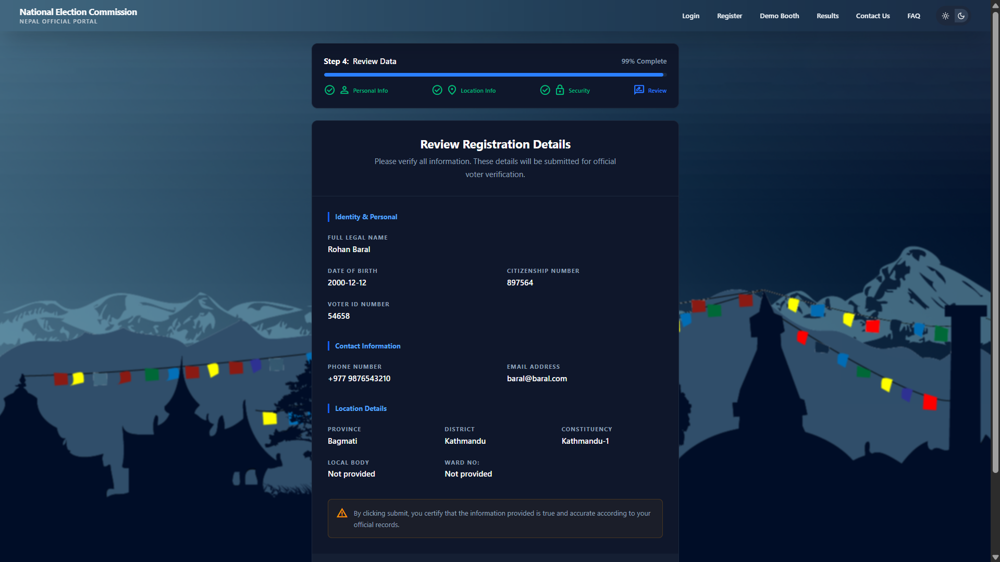

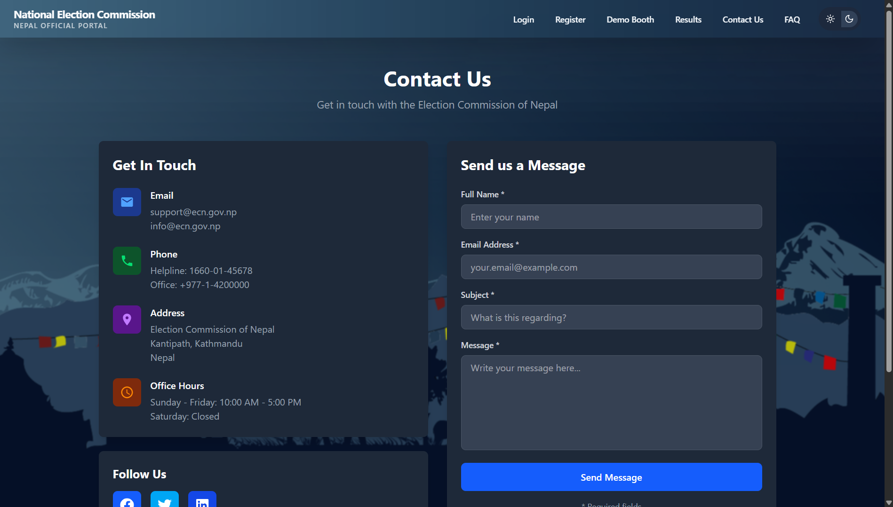

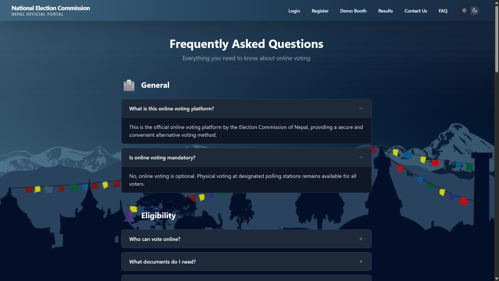

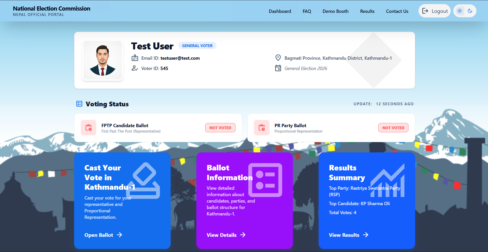

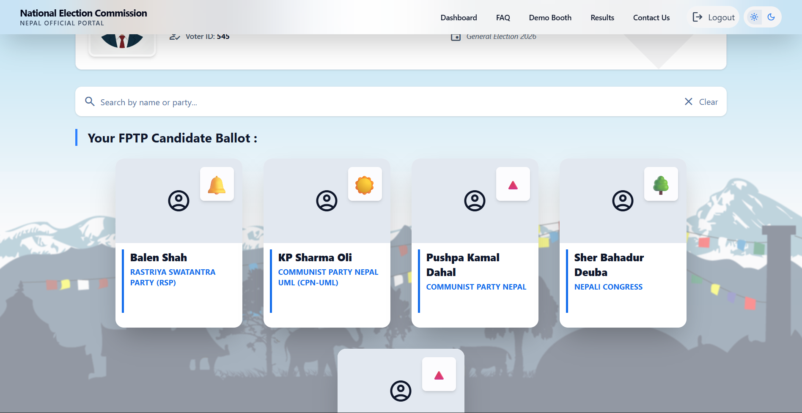

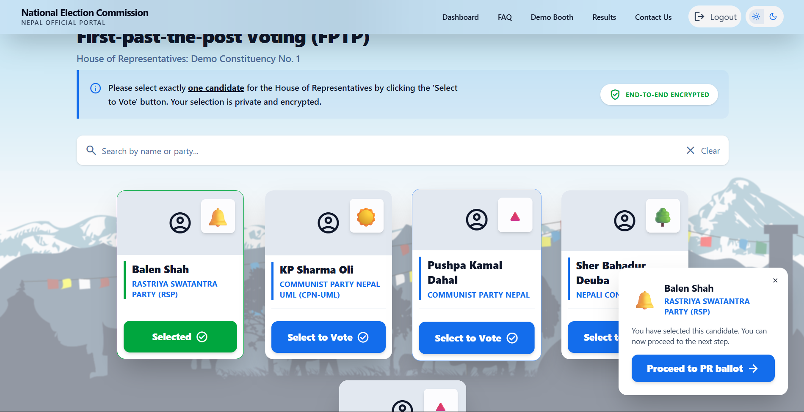

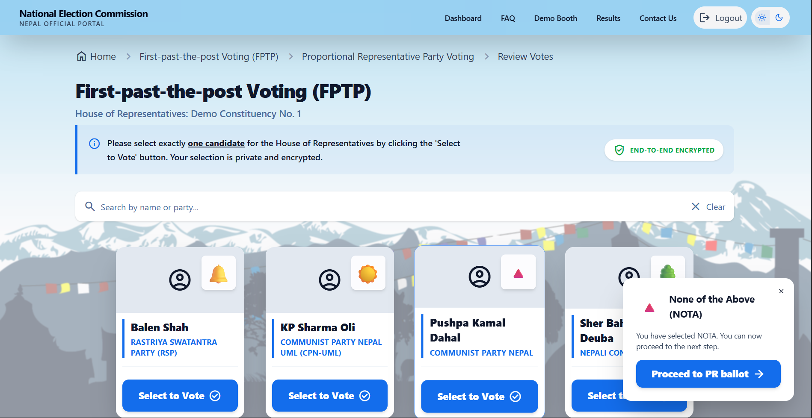

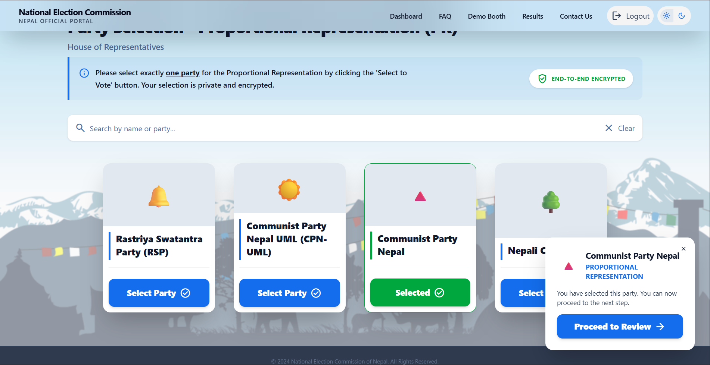

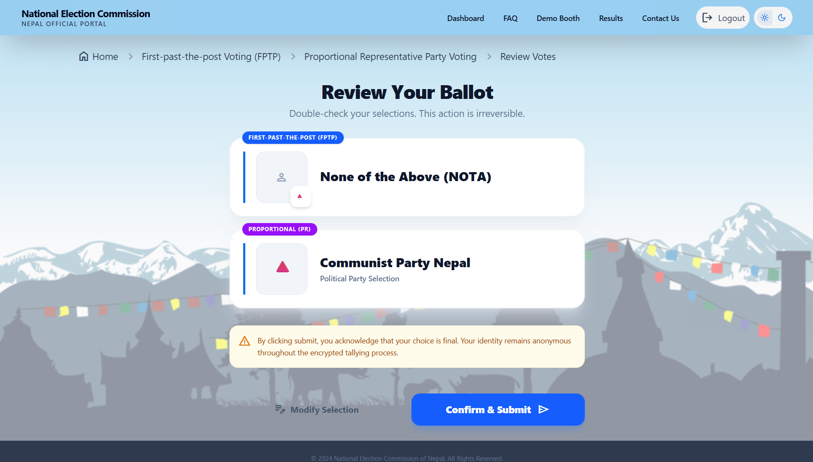

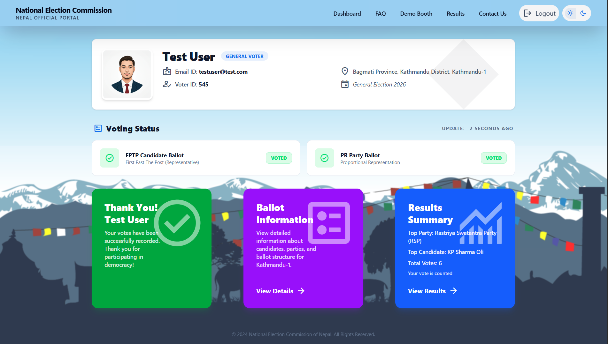
